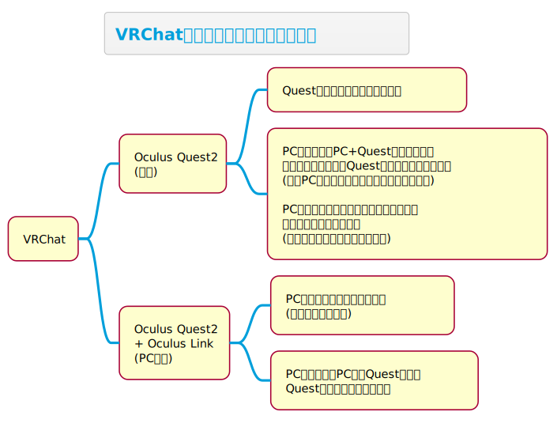
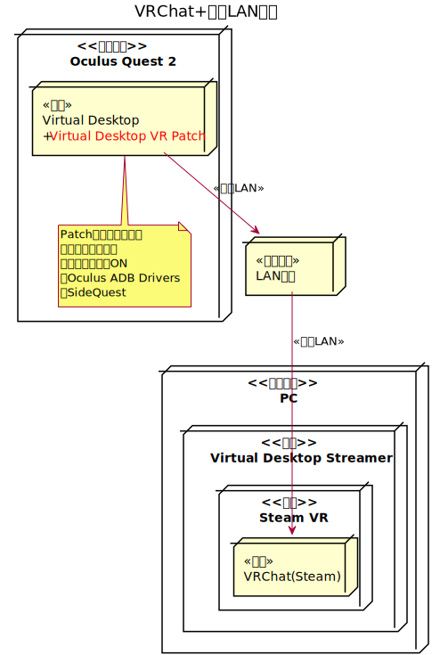

<!-- Global site tag (gtag.js) - Google Analytics -->

# {{ page.title }}

VRChatをOculus Quest2で楽しむための情報がうまく探せなかったり、記事が古かったりしたため、ポイントを絞ってまとめました。(最終更新日:{{ page.last_modified_at | date: "%Y年%m月%d日" }})

- [公式](#公式)
- [遊び方](#遊び方)
- [環境・操作](#環境操作)
  - [Oculus Quest2の各部名称](#oculus-quest2の各部名称)
  - [Oculus Quest2の操作](#oculus-quest2の操作)
  - [VRChatのアバター利用制限・見え方](#vrchatのアバター利用制限見え方)
  - [VRChatのアバターをQuest対応にする](#vrchatのアバターをquest対応にする)
  - [VRChat+Oculus Quest2のボタン操作](#vrchatoculus-quest2のボタン操作)
  - [VRChat+Oculus Quest2のハンドサイン](#vrchatoculus-quest2のハンドサイン)
  - [Oculus Quest2+Oculus LinkでVRChatにPC接続しマイクが認識されない](#oculus-quest2oculus-linkでvrchatにpc接続しマイクが認識されない)
  - [Oculus Quest2+Virtual DesktopでVRChatに接続する](#oculus-quest2virtual-desktopでvrchatに接続する)
  - [左右にAction Menuを出す](#左右にaction-menuを出す)
- [倉庫](#倉庫)
- [連絡先](#連絡先)

## 公式

- [VRChat(英語)](https://hello.vrchat.com/)
- [Oculus(日本語)](https://www.oculus.com/)
- [Oculusサポートページ(日本語)](https://support.oculus.com/)

## 遊び方

実際にやってみないと分からないことが多すぎるため、まず下記をおすすめします（）

|No|内容|
|--|--|
|1|VRChatを起動してアナウンス通りにすすめ、なんとかしてVRChatのホームにたどりつく。|
|2|B or Yボタンを押して通常メニューからSettingsを開いて、しゃべってみてMicrophoneが反応することを確認する。|
|3|通常メニューのWorldを開いて、Seachを選択し、キーボードを使って「jp」と打ち込み、OKする。|
|4|「[JP] Tutorial world」を選択し、Goし、worldに入る。|
|5|人が来たら挨拶して話しかける。初心者と言えば大抵の人はいろんなことを教えてくれる。その人に楽しい遊び方を聞きましょう（）|
|*|私は英会話をすることが目的でVRChatを始めており、今は大抵下記のワールドに出没しています。|
|*|1)「[EN-JP Language Exchange](https://vrchat.com/home/world/wrld_153be667-a86e-4aaf-9eed-921bd568ee9b)」→日本語を学びたい英語話者や英語を学びたい日本人が訪れる。英語日本語言語交換イベント用に作られたワールド。|
|*|2)「[Japan Srine](https://vrchat.com/home/world/wrld_736bad27-4663-4346-a345-26e1e859d94e)」→とにかく人が多く誰かはいるが日本人は少なめです。|

## 環境・操作

### Oculus Quest2の各部名称

|No|内容|
|--|--|
|1|頭にかぶるものはOculus Quest2 ヘッドセット|
|2|ヘッドセットの右側にあるボタンが電源ボタン|
|3|ヘッドセットの下側にあるボタンが音量ボタン|
|4|ヘッドセットの左側にある差し込み口がOculus Link(オキュラス リンク)とイヤホンの差し込み口|
|5|コントローラーの名称はOculus Touch(オキュラス タッチ)|
|6|右コントローラーにはAボタン、Bボタン、Oculus(オキュラス)ボタン、Stick(スティック)、Trigger(トリガー)ボタン、Grip(グリップ)ボタン|
|7|左コントローラーにはXボタン、Yボタン、Menu(メニュー)ボタン、Stick(スティック)、Trigger(トリガー)ボタン、Grip(グリップ)ボタン|

### Oculus Quest2の操作

|判定|内容|
|--|--|
|Touch|A、B、X、Yボタン、Oculusボタン、Menuボタン、左右コントローラーのStickボタン(上から押し込むとボタンになる)、Triggerボタン、Gripボタン|
|Click|〃|
|Hold|(=長押し)　〃|
|その他|Stickを傾ける。ヘッドセットやコントローラーの向き変更、移動|

### VRChatのアバター利用制限・見え方

|PC|Quest|Type|内容|
|--|--|--|--|
|〇|×|PC専用|PC接続のみで利用できるアバター|
|〇|〇|PC+Quest|PC接続、Quest単体の両方で利用できるアバター|
|×|〇|Quest専用|通常存在しないアバター|

### VRChatのアバターをQuest対応にする

|No|内容|
|--|--|
|0|前提：既にPC対応のアバターをVRChatにアップロードできていること。 ※SDK3.0しか確認していません。 ※Quest対応のアバターを追加することで、PC+Questのアバターにすることができます。|
|1|PC対応のファイルを退避する(Gitなどで別途Quest用のブランチを切るのが良いと思う)|
|2|Hierarchyの要素を順に選択し、Shaderを「VRChat/Mobile/Toon Lit」に変更する。|
|3|Hierarchyの検索欄に「script」と打ち込み検索する。|
|4|検索結果を順に選択し、Inspectorで「Dynamic Bone(Script)」とあれば右側の設定アイコンをクリックし、「Remove Component」を選択して削除する。|
|5|Unityの「File/Build Settings」からPlatform欄の「Android」を選択し、「Switch Platform」ボタンを押す。|
|6|InspectorのPipeline ManagerでBlueprint IDにPC対応アバターのIDを設定する(PC対応アバターをアップロードすると、IDが自動で設定されるため、続けて作業した場合、この作業は不要なはず)|
|7|PC対応アバターのときと同様の操作でVRChatにアップロードする。|

### VRChat+Oculus Quest2のボタン操作

Normal Avatar + TypeA-Default

|操作|Quest|Oculus Link|SteamVR|
|--|--|--|--|
|A Touch|Right Hand Sign|-|-|
|A Click|Jump|-|-|
|A Hold|None|-|-|
|B Touch|Right Hand Sign|-|-|
|B Click|Right Qick Menu|-|-|
|B Hold|Right Action Menu|-|-|
|Oculus Touch|None|-|-|
|Oculus Click|Quest Menu|-|-|
|Oculus Hold|???|None|???|
|Right Stick Touch|Right Hand Sign|-|-|
|Right Stick Click|None|-|-|
|Right Stick Hold|None|-|-|
|Right Trigger Touch|Right Hand Sign|-|-|
|Right Trigger Click|None|-|-|
|Right Trigger Hold|None|-|-|
|Right Grip Touch|None|-|-|
|Right Grip Click|Right Hand Sign|-|-|
|Right Grip Hold|None|-|-|
|X Touch|Hand Sign|-|-|
|X Click|Mute Self|-|-|
|X Hold|None|-|-|
|Y Touch|Hand Sign|-|-|
|Y Click|Left Qick Menu|-|-|
|Y Hold|Left Action Menu|-|-|
|Menu Touch|None|-|-|
|Menu Click|Left Quick Menu|-|SteamVR VRChat Menu|
|Menu Hold|Left Action Menu|-|Switch to Desktop|
|Left Stick Touch|Left Hand Sign|-|-|
|Left Stick Click|None|-|-|
|Left Stick Hold|None|-|-|
|Left Trigger Touch|Left Hand Sign|-|-|
|Left Trigger Click|None|-|-|
|Left Trigger Hold|None|-|-|
|Left Grip Touch|None|-|-|
|Left Grip Click|Left Hand Sign|-|-|
|Left Grip Hold|None|-|-|

### VRChat+Oculus Quest2のハンドサイン

ほとんどのアバターにはハンドサインによる表情等の変化に対応しており、覚えておいて損はない操作になるはずです(割り当てはアバター側の設定)

Touch+ = Touch or Click or Hold、Click+ = Click or Hold

|Sign|内容|
|--|--|
|Right Default|Right Trigger Touch+|
|Left Default|Left Trigger Touch+|
|Right Fist|(A or B or Right Stick)Touch+ & Right Trigger Touch+ & Right Grip Click+|
|Left Fist|(X or Y or Left Stick)Touch+ & Left Trigger Touch+ & Left Grip Click+|
|Right HandOpen|(A or B or Right Stick or Right Trigger)No Touch & Right Grip No (Click or Hold)|
|Left HandOpen|(X or Y or Left Stick or Left Trigger)No Touch & Left Grip No (Click or Hold)|
|Right FingerPoint|(A or B or Right Stick)Touch+ & Right Grip Click+|
|Left FingerPoint|(X or Y or Left Stick)Touch+ & Left Grip Click+|
|Right Victory|(A or B or Right Stick)Touch+|
|Left Victory|(X or Y or Left Stick)Touch+|
|Right Rock'n Roll|(A or B or Right Stick)Touch+ & Right Trigger Click+|
|Left Rock'n Roll|(X or Y or Left Stick)Touch+ & Left Trigger Click+|
|Right Handgun|Right Grip Click+|
|Left Handgun|Left Grip Click+|
|Right Thumbs-Up|Right Trigger Click+ & Right Grip Click+|
|Left Thumbs-Up|Left Trigger Click+ & Left Grip Click+|

### Oculus Quest2+Oculus LinkでVRChatにPC接続しマイクが認識されない

既知の不具合らしく、下記のような手順を取る必要があります(全然直らない)

|No|内容|
|--|--|
|1|Oculus Quest2を起動してOculus Linkを挿し、データへのアクセスを許可してPCと接続する。|
|2|Oculus Quest2のメニュー/設定から「Oculus Link」を選択してRiftにする。|
|3|VRChatを起動してログインし、Settingを開いて、しゃべってみてMicrophoneの「Headsdet Microphone(Oculus Virtual Audio Device)」が反応するか確認する。|
|4|反応しなかったら、Oculusボタンを押し、Riftのメニューから「Oculus Linkをオフにする」を選択し「オフにする」を選択すると、Oculus Quest2のメニュー/設定に戻り、少し経つと「Oculus Link」が一旦消える。データのアクセスを許可を求められれば許可する。 ~~※一旦消える前に「Oculus Link」を選ぶとVRChatで地面に潜らず再起動する必要も無く手間が少なくなる。(この技が使えなくなっている)~~|
|5|Oculus Quest2のメニュー/設定に再び「Oculus Link」が表示されるので、選択して再度Riftにする。|
|6|VRChat画面に戻る(私の環境ではこの時地面に潜っていることがあり、その場合はVRChatを再起動する。私の場合はOculusボタンを押し、Riftのメニューから「ホーム」を選択してVRChatを閉じています)|
|7|再びVRChatにログインしてSettingを開き、しゃべってみてMicrophoneの「Headsdet Microphone(Oculus Virtual Audio Device)」反応するか確認する。|

※Oculus Linkを接続した状態で、PC側のサウンドコントロールパネル/録音で「既定のデバイス」が「Headset Microphone(Oculus Virtual Audio Device)」になっていなければ設定してください（既に設定されている場合、一旦別デバイスに変更し、戻すとうまくいくかもしれません）

※PC側のOculusアプリでデバイス設定/Quest2とTouchを選択し、「Quest2マイク」、「Quest2ヘッドホン」を選択することが公式おすすめのようです。その下にある「デバイスを設定」ですが一度は行っておくべきかもしれません。

※[Oculus QuestとOculus Linkのトラブルシューティング](https://support.oculus.com/358707732169608/)

### Oculus Quest2+Virtual DesktopでVRChatに接続する

※「Virtual Desktop VR Patch」はFacebookからの要請で削除したSteamVR接続機能を復活させるものとのことです。Oculusの承認は得ていないためグレー扱いになりますが、Oculus側も黙認しているようです。Virtual Desktopを信じるのであれば特に問題は無いと思われます。

|No|内容|
|--|--|
|0|前提：Oculus QuestのVirtual Desktopアプリを購入できること。VRChatが動作するスペックで、QuestとUSB接続できるPCを保持していること。Steamのアカウントを持っていること。自己責任でOculusが認可していないVitual Desktopのパッチを入れることができること。|
|1|各アプリをインストールする(順不同のはず) ・Oculus Quest2のVirtual Desktopを購入しインストール ・PCにVirtual Desktop Streamerをインストール ・SteamでSteamVR、VRChatをインストール|
|2|スマホアプリ/Oculusの設定からOculus Quest2/その他の設定/開発者モードを開きONにする。「開発者になろう」が出てきたら「作成開始」する。 ※作成後、開発者モードになっていることを確認する(私は「作成開始」したあと開発者モードが外れていました)|
|3|[Oculusの開発者サイト](https://developer.oculus.com/)にログインして新しい組織を作成し、開発/ダウンロードを開き、Developer Toolsから「Oculus ADB Drivers」を選んでダウンロードする(zipファイル)|
|4|ダウンロードしたzipファイルを解凍し、「usb_driver」フォルダの「android_winusb.inf」を選択して右クリックメニューからインストールする。|
|5|[SideQuestサイト](https://sidequestvr.com)にアクセスして、SideQuestをダウンロードし、インストールする。インストール後にSideQuestを起動しておく。|
|6|Oculus Quest2とPCをUSBで接続する。その時Quest画面の方で「USBのデバッグを許可するか」聞かれるので許可する。 ※SideQuest画面左上アイコンが緑になっていることを確認する。|
|7|SideQuestの検索窓から「Virtual Desktop VR Patch」を検索し、インストールする(「INSTALL TO HEAD SET」を選択)|
|8|Oculus Quest2のVirtual Desktopを再起動してPCに接続し、「Launch SteamVR」を選択してSteamVRを起動する。|
|9|Steam版のVRChatを起動する(左コントローラーのMenuボタンから選択可)|
|10|動作が確認できれば、スマホアプリ/Oculusの開発者モードをOFFにしておくのがよいでしょう。|

### 左右にAction Menuを出す

左右合わせて２つのAction Menuを同時に出すための手順となります。

|No|内容|
|--|--|
|1|右側のAction Menuを普通に出す →(B or Y)ボタンClickからQuick Menuを表示しEmote->Action Menu もしくはBボタンの長押し|
|2|左側のAction Menuを出す。 →Yボタンの長押し もしくは左コントローラーのMenuボタンを長押し|

※音無テム(VRChatアバター)で、片方はフキダシテキスト選択、もう片方はフキダシ表示をするときに必要

## 倉庫

特に必要では無くなったものの倉庫

[倉庫](storage)

## 連絡先

何かあればTwitterの方に連絡ください。

[Twitter](https://twitter.com/sushi_osaka99)
